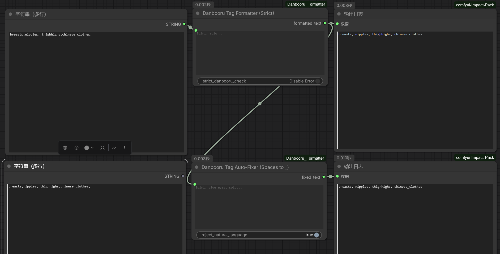

# ComfyUI_Danbooru_Formatter
这是两个用来给输入提示词（prompt）按danbooru tag的格式（tag_a， tag_b, ...）进行转换并输出转换后提示词的ComfyUI节点。

These are two ComfyUI nodes used for converting input prompts into the Danbooru tag format (tag_a, tag_b, ...) and outputting the converted prompts.

节点功能与示意工作流：（nodes function and workflow examples）

（1）Danbooru Tag Formatter（Strict）node：

此节点主要执行补全空格来使得输入prompt符合danbooru格式的功能。只要是仅以逗号分隔的，它都会自动修正为, （即逗号加空格）并自动去除首尾的空格 （e：如果输入是 tag_a,tag_b，输出会自动变成 tag_a, tag_b）。

注：strict_danbooru_check这一功能开启后如果输入的内容里包含 blue hair（中间有空格）而不是 blue_hair，或者是一整句没有逗号的自然语言，节点会变红并停止运行，控制台会显示具体的错误信息。因此平时保持关闭即可。

This node primarily performs the function of adding spaces to make the input prompt conform to the Danbooru format. As long as it is solely separated by commas, it will automatically correct them to ", " (i.e., comma plus space) and automatically remove leading and trailing spaces (e.g., if the input is "tag_a,tag_b", the output will automatically become "tag_a, tag_b").

Note: When the "strict_danbooru_check" function is enabled, if the input contains something like "blue hair" (with a space in the middle) instead of "blue_hair", or if it is a whole sentence of natural language without commas, the node will turn red and stop running, and the console will display specific error information. Therefore, it can usually be kept turned off.

（2）Danbooru Tag Auto-Fixer（Spaces to _）node:

此节点主要对输入的danbooru tag进行检测，如果内部有空格（例如 blue eyes），会自动将其修正为下划线（blue_eyes）后再输出。

注：reject_natural_language这一功能的初衷是能够识别出自然语言并报错，但在实际使用中效果不佳（在识别自然语言方面不太行），因此保持关闭即可。

This node primarily detects the input Danbooru tags. If it finds any spaces within a tag (e.g., "blue eyes"), it will automatically correct them by replacing the spaces with underscores ("blue_eyes") before outputting.

Note: The "reject_natural_language" function is intended to identify natural language and trigger an error, but it does not perform well in practice (it is not very effective at recognizing natural language). Therefore, it can be kept turned off.

（3）示例工作流（example workflow）

